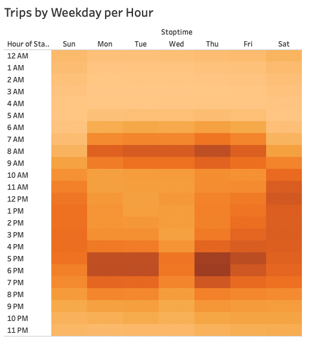
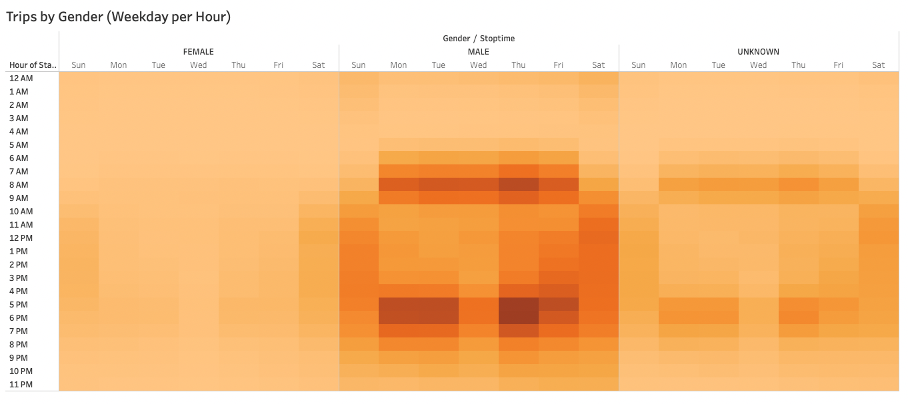
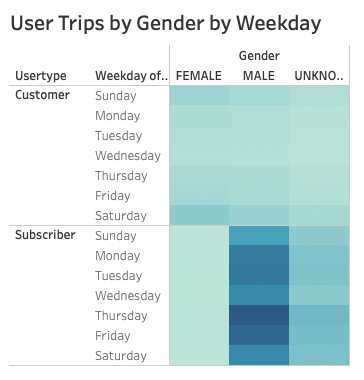
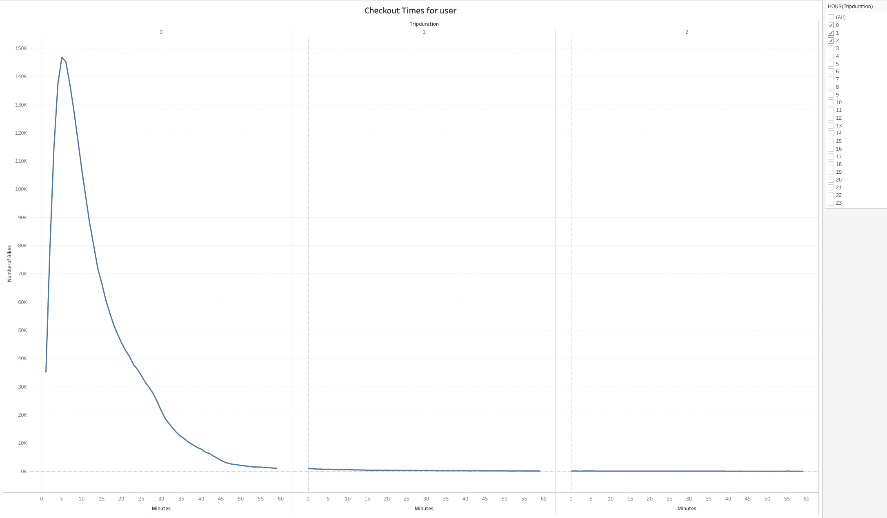
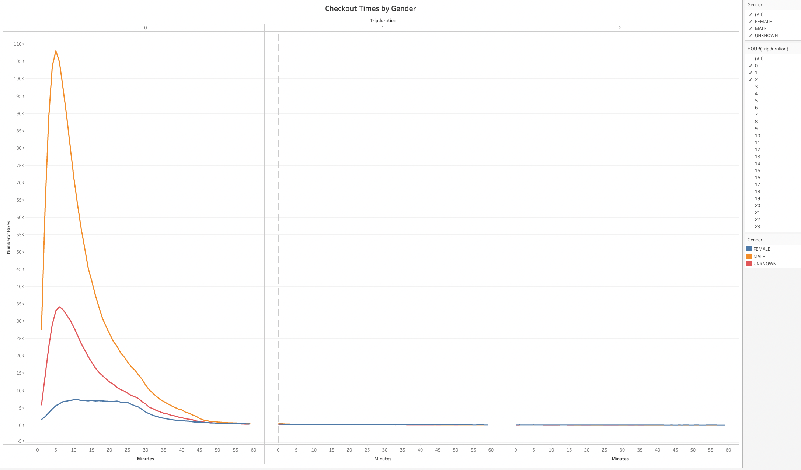
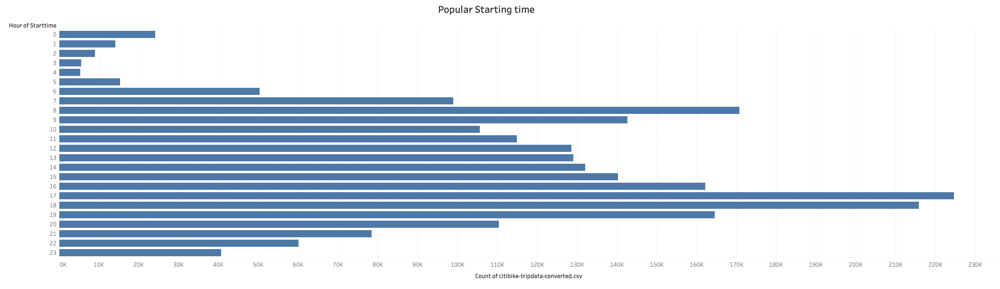
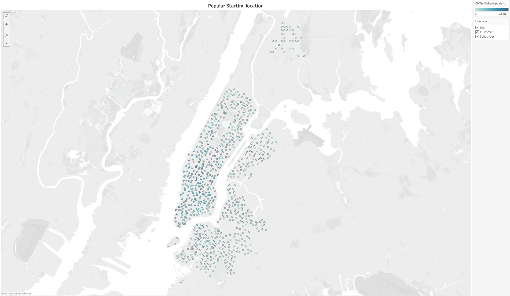

# bikesharing

Click here to view the Dashboards on Tableau: 

[NYC Bike Sharing Story](https://public.tableau.com/shared/JCFW7RJ9S?:display_count=n&:origin=viz_share_link)

[NYC Bike Sharing Dashboard](https://public.tableau.com/views/NYC-BikeSharingDashboard_16496309552700/Dashboard?:language=en-US&:display_count=n&:origin=viz_share_link)

## Overview of Analysis
The purpose of this analysis is to create a proposal that supports investors to support a bike-sharing program in Des Moines, Iowa. From the given dataset, we were able to create visualizations to see average biking durations trends and the relationships between gender and popular biking times. Specifically, this set of visualizations: 

* Show the length of time that bikes are checked out for all riders and genders
* Show the number of bike trips for all riders and genders for each hour of each day of the week
* Show the number of bike trips for each type of user and gender for each day of the week.

## Results
The results of the analysis and visualizations are shown below:

### Trips per Hour by Weekday 

- More riders prefers Evening times

    
### Trips per Weekday by Gender:

  
#### Analysis:
    - Male commuters are more compare to Female users

 ### User Trips_Weekday by Gender:
    -  Monday, Tuesday, Thrusday and Saturdays are usually busy
 

       
### Checkout Times For Users:

 ### Checkout Times by Gender:

- Male commuters are utilizing bikes rental higer to other genders
 

 ### Popular Starting time:

- Evening Times are usually busy

### Popular Starting location:

- Populart Starting location is Manhattan

## Summary

- Majority of the customers are Subscribers and Peak times are around morning and Evenings
- Maintance should be Takesn place during Early Moring Hours. Prefered Midnight to 5 AM Local Time
- Base on data, most of the commuters are working in NYC, so its good to have stations set within 10 mins apart
